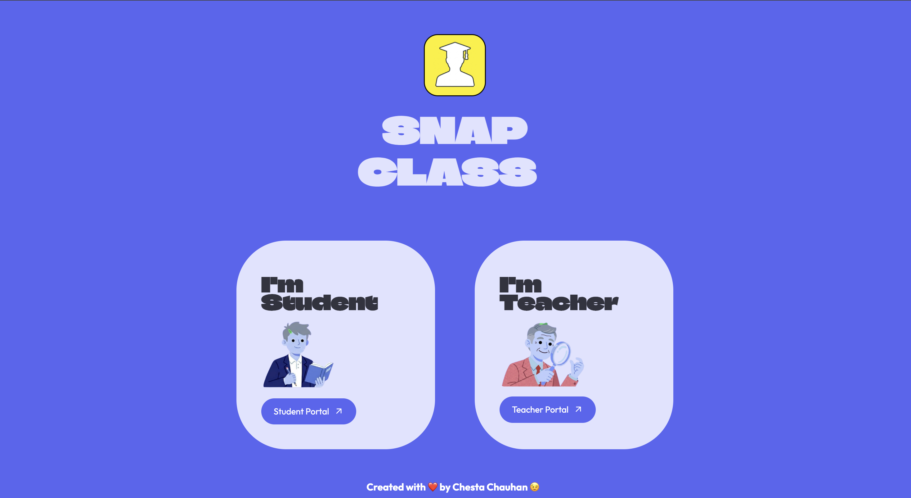
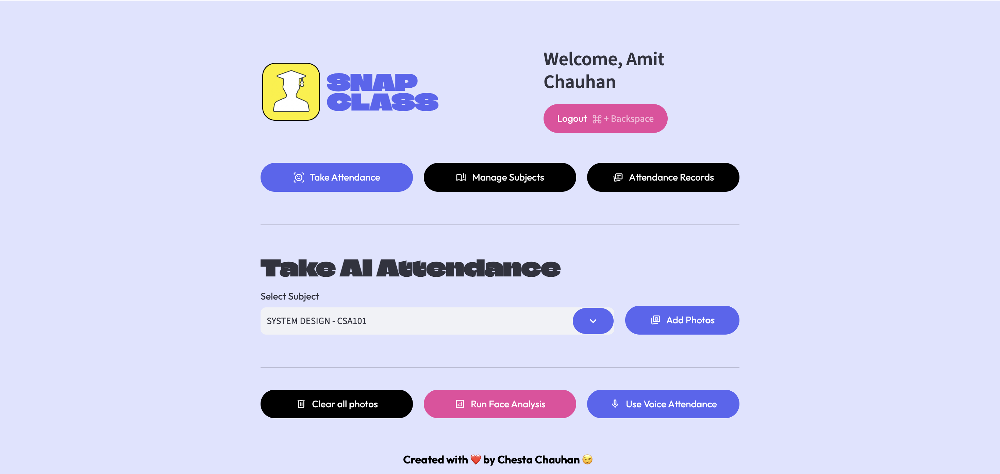
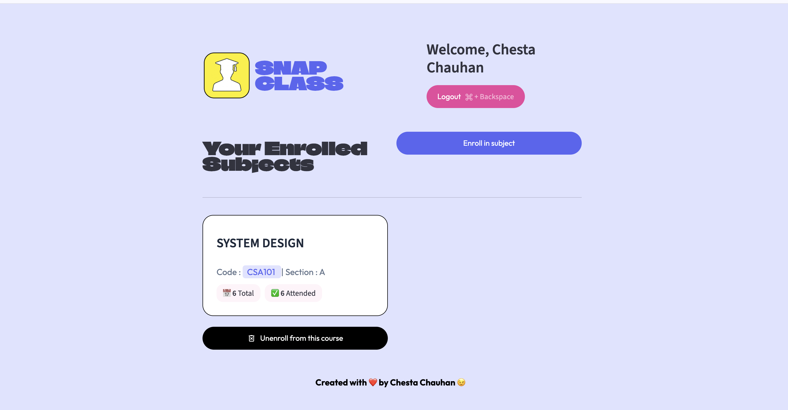
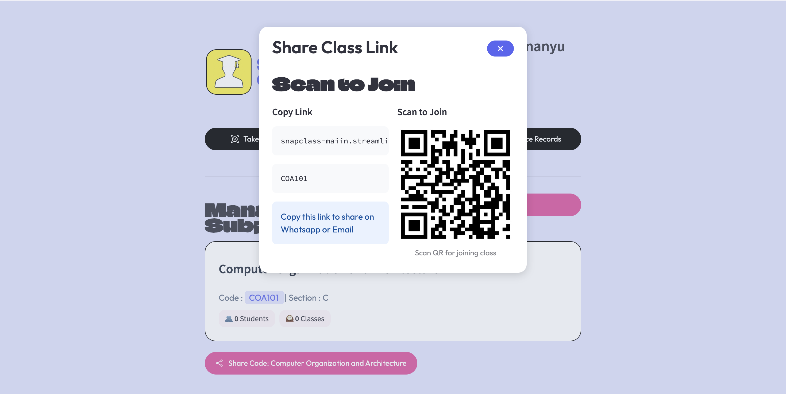
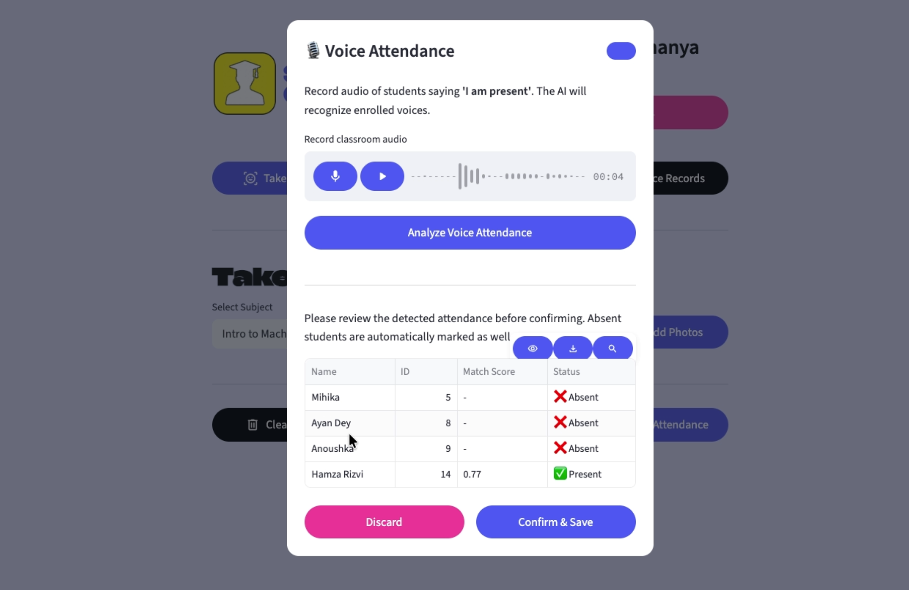
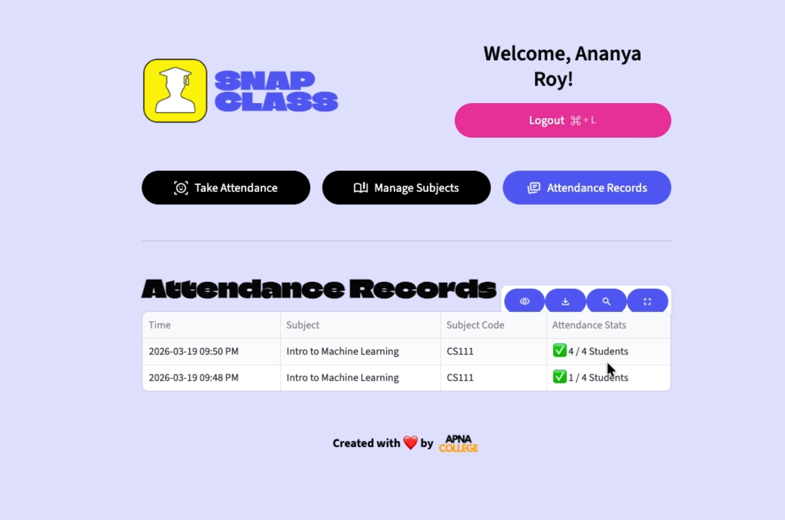

# 🎓 SnapClass

> **AI-Powered Classroom & Attendance Management System**

SnapClass is an AI-powered classroom and attendance management system that leverages **Face Recognition**, **Voice Recognition**, and **QR Code-based classroom enrollment** to simplify attendance management. Built with **Python**, **Streamlit**, and **Supabase**, it provides a secure and efficient platform for teachers and students.

<p align="center">

<a href="https://snapclass-maiin.streamlit.app/">


</a>

<a href="https://snapclass-landing-page-eight.vercel.app/">


</a>

</p>

---

## 🌐 Live Links

🚀 **Application:**  

https://snapclass-maiin.streamlit.app/

🌍 **Landing Page:**  

https://snapclass-landing-page-eight.vercel.app/

---

## 📌 Overview

SnapClass modernizes classroom attendance by integrating biometric authentication and cloud-based classroom management into a single platform.

Teachers can create classrooms, generate QR codes for students to join, and monitor attendance records. Students securely verify their identity using Face Recognition or Voice Recognition before attendance is recorded.

---

## ✨ Features

### 👨‍🏫 Teacher Portal

- Secure Login

- Create & Manage Classrooms

- Generate QR Codes for Classroom Joining

- View Enrolled Students

- Monitor Attendance Records

### 👨‍🎓 Student Portal

- Secure Login

- Join Classroom using QR Codes

- Face Recognition Attendance

- Voice Recognition Attendance

- View Joined Classrooms

---

## 🛠️ Tech Stack

| Category | Technologies |

|----------|--------------|

| Language | Python |

| Framework | Streamlit |

| Database | Supabase |

| Face Recognition | face_recognition, dlib |

| Voice Recognition | Resemblyzer, Librosa |

| Authentication | bcrypt |

| QR Code | Segno |

| Image Processing | Pillow |

| Data Processing | NumPy, Pandas |

---

## 📂 Project Structure

```text

SnapClass/

│

├── src/

│   ├── components/

│   ├── database/

│   ├── pipelines/

│   ├── screens/

│   └── ui/

│

├── app.py

├── requirements.txt

└── README.md

```

---

## 📸 Application Preview

## 🏠 Home Page

<p align="center">



</p>

## 👨‍🏫 Teacher Dashboard

<p align="center">



</p>

##  👨‍🎓 Student Dashboard

<p align="center">



</p>

## 📱 QR Code Classroom Joining
<p align="center">



</p>

## 🎤 Voice Recognition Attendance
<p align="center">



</p>

## 📊 Attendance Records
<p align="center">



</p>
---

## 🚀 Installation

```bash

git clone https://github.com/chesta02/Snapclass-main.git

cd Snapclass-main

pip install -r requirements.txt

streamlit run app.py

```

Configure your **Supabase** credentials inside:

```text

.streamlit/secrets.toml

```

---

## 🔒 Security

- Password Encryption (bcrypt)

- Face Recognition Authentication

- Voice Recognition Authentication

- Secure Cloud Database (Supabase)

- Role-Based Access Control

---

## 🎯 Future Enhancements

- Mobile Application

- Attendance Analytics

- Email Notifications

- Export Attendance Reports

- Multi-Institution Support

---

## 👩‍💻 Author

**Chesta Chauhan**

B.Tech CSE (AI/ML & Robotics)  

DIT University

---

<div align="center">

⭐ If you found this project useful, don't forget to star the repository!

</div>
